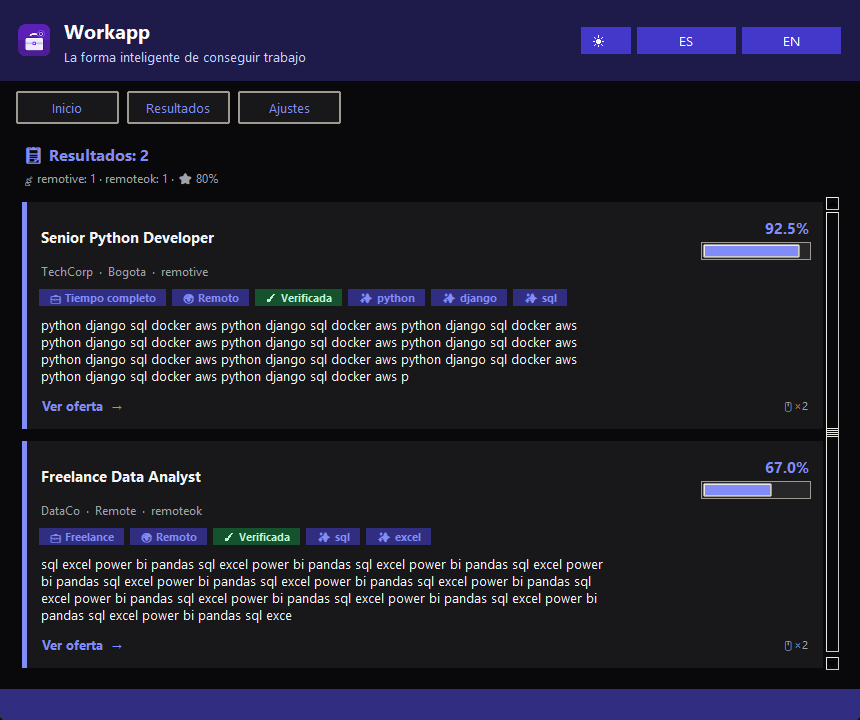

<div align="center">

# 💼 Workapp

**La forma inteligente de conseguir trabajo · The smart way to get a job**

[](https://maurux01.github.io/workapp/)
[](https://github.com/Maurux01/workapp/releases/latest)
[](https://www.python.org/downloads/)
[](https://supabase.com)
[](./license)

🌐 **[Probar en el navegador](https://maurux01.github.io/workapp/)** — sin instalar nada, ofertas remotas en vivo, ES/EN, modo oscuro
· 💾 **[Descargar .exe para Windows](https://github.com/Maurux01/workapp/releases/latest)** — doble clic y listo, sin Python ni terminal



</div>

## ✨ Qué hace

| Función | Detalle |
|---|---|
| 🔎 Búsqueda multi-fuente | **9 fuentes**: LinkedIn, WWR, HN Hiring, RemoteOK, Remotive, Arbeitnow, Jooble, Indeed, Computrabajo |
| 📄 Análisis de CV | Sube tu PDF → email, teléfono, skills y experiencia |
| ✨ Match con tu CV | Una búsqueda por cada skill top de tu CV, todo rankeado por % de match |
| 🛡 Anti-fraude + anti-fantasma | Bloquea `bairesdev`/`manstaff`, carnadas "banco de talentos" y reposts +60 días |
| 🗄 Supabase | Cada búsqueda se guarda sola (upsert por `url`, sin duplicados) |
| 🌐 ES/EN total + 🌙 oscuro por defecto | Toda la interfaz cambia de idioma y tema, sin textos mezclados |
| 📍 Colombia por defecto | Dominios `.co` y `WORKAPP_LOCATION` configurable |

## 🚀 Instalación (elige una)

**1. Para todos (recomendado):** descarga `Workapp.exe` en
[Releases](https://github.com/Maurux01/workapp/releases/latest) → doble clic.
Si SmartScreen avisa: *Más información → Ejecutar de todas formas*.
Sin terminal, con icono propio en ventana y barra de tareas.

**2. En el navegador:** abre https://maurux01.github.io/workapp/ — 5 APIs remotas en
vivo, tu CV se procesa solo en tu equipo, caché de 24 h.

**3. Desde código:**
```bash
git clone https://github.com/Maurux01/workapp.git
cd workapp
pip install -r requirements.txt
cp .env.example .env   # el .env real NUNCA se sube a git
```
- Escritorio sin terminal → doble clic en `Workapp.pyw`
- Escritorio (instala deps) → doble clic en `Workapp.bat`
- Web local (9 fuentes + Supabase) → `python main_web.py`, abre el navegador sola

## 📖 Uso

1. **Sube tu CV** en PDF.
2. **Busca** por palabra clave + ubicación, con filtros de jornada
   (tiempo completo, medio tiempo, freelance, pasantía) y modalidad
   (remoto, presencial, híbrido) — o dale a **✨ Buscar empleos para mi CV**
   para una búsqueda por cada skill.
3. Doble clic en una tarjeta para ver el **detalle completo**; la franja de
   resumen muestra conteo por fuente y promedio de match.
4. Cambia **ES/EN** o **🌙/☀️** cuando quieras; bloquea más empresas con
   `BLOCKED_COMPANIES=otra1,otra2` en tu `.env`.

## 🗄 Supabase (opcional, 2 min)

1. Corre `supabase/schema.sql` en el **SQL Editor** (tabla `jobs` + RLS + índices + grants).
2. Copia `SUPABASE_URL` y `SUPABASE_KEY` (**anon**, nunca `service_role`) a tu `.env`.
3. Sin keys la app funciona igual con caché local de 24 h.

> ⚠️ Nunca subas tu `.env` a git. Solo `.env.example` (sin secretos) vive en el repo.

## 🗂 Estructura

```
Workapp.pyw / .bat / .exe   lanzadores desktop (sin consola)
main_desktop.py · main_web.py
core/        cv_analyzer · job_matcher · spam_detector (anti-fantasma)
scrapers/    9 fuentes + manager (cache 24h, dedupe, blocklist, Supabase)
parsers/     pdf, limpieza HTML, inferencia jornada/modalidad
storage/     cache local + supabase · supabase/schema.sql
ui/          desktop tkinter (theme.py claro/oscuro) · web/ Flask local
index.html + assets/   sitio estático de GitHub Pages (favicon + devicon)
```

## ❓ FAQ

- **¿Sale una terminal?** Solo si abres `main_desktop.py`. Usa `Workapp.pyw` o el `.exe`.
- **¿Remotive es de pago?** No, su API pública es gratis (verificado en vivo).
- **¿Upwork?** Sin feed público (mató su RSS, muro Cloudflare) — freelance cubierto vía Remotive/RemoteOK/WWR/HN.
- **¿Jooble/Indeed/Computrabajo fallan a veces?** Sí, muro anti-bots (403/500); la app sigue con las demás + caché + muestra.
- **¿Mis datos?** PDFs en `data/CVs/`, caché en `data/cache/` — todo local e ignorado por git.
